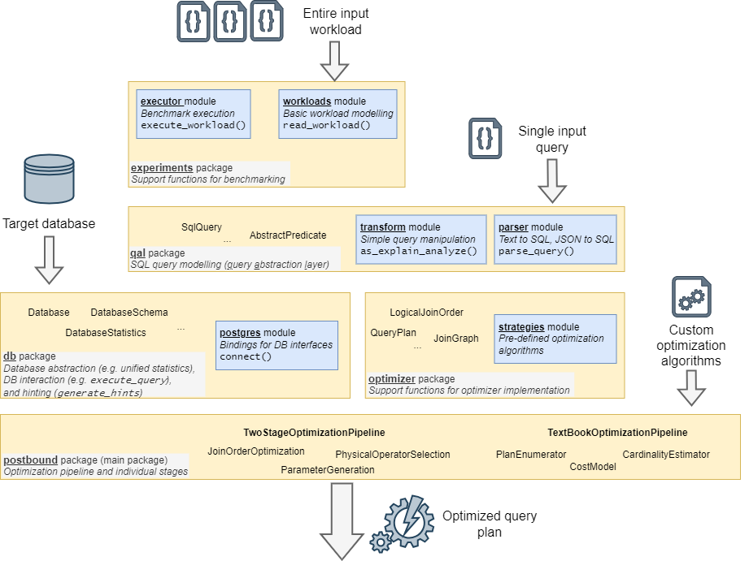

# PostBOUND


PostBOUND is a framework for studying query optimization algorithms for (relational) database systems. It provides
tools to easily implement prototypes of new optimization algorithms and to compare them in a transparent and
reproducible way. It is implemented as a Python tool that takes an input query, applies a user-configured optimization pipeline
to that query and produces an annotated output query that enforces the selected query plan during execution on a native
database system.
This repository provides the actual Python implementation of the PostBOUND framework (located in the
`postbound` directory), along with a number of utilities that automate some of the tedious parts of evaluating an optimization
algorithm on a specific benchmark. Those utilities are mostly focused on setting up different popular database management
systems and loading commonly used databases and benchmarks for them.


## Getting Started

> [!TIP]
> PostBOUND can also as an all-in-one Docker container. See [Dockerfile](#Dockerfile) for details.

All package requirements can be installed from the `requirements.txt` file. To use PostBOUND in different projects,
it can also be build and installed as a local package using pip. This is generally the recommended way to go and can be
automated using the `tools/setup-py-venv.sh` script.

In addition to the Python packages, PostBOUND also needs a database connection in order to optimize and execute queries.
Currently, PostgreSQL and MySQL are supported, with the MySQL features being a bit more limited due to restrictions of
the system. The root directory of the PostBOUND repository contains setup utilities for some database systems, databases
and workloads.

The best way to familiarize yourself with PostBOUND is to study the examples and the documentation of the used classes
and functions. A high-level documentation is also being worked on, but still subject to change and not entirely
up-to-date. Therefore, the Python documentation of the source code is more extensive. Consult it for the specifics of _how_ to
use a specific feature and take a look at the examples to get an idea of _when_ to use it and which features are available. The
best starting point for the in-code documentation is the `__init__.py` file in the `postbound` source directory.

We also published a paper[^1] which explains the concepts that motivated the initial versions of PostBOUND.
Notice however, that at the time of its publication the framework had a much more limited scope and was heavily
expanded since then. More specifically, PostBOUND is no longer limited to upper bound-driven optimization strategies
and much more independent of specific database systems.


## Example

The following snippet gives a glimpse of the different parts of the framework and how they can interact. The specific
example implements the UES upper-bound optimization algorithm[^2] to obtain an optimized join order for the queries of
the Join Order Benchmark[^3] and applies them to a Postgres database instance.

```python
##
## Step 0: imports
##

import postbound as pb
from postbound.optimizer import presets

##
## Step 1: System setup
##
postgres_instance = pb.postgres.connect()
presets.apply_standard_system_options()
job_workload = pb.workloads.job()
ues_settings = presets.fetch("ues")

##
## Step 2: Optimization pipeline setup
##
optimization_pipeline = pb.TwoStageOptimizationPipeline(postgres_instance)
optimization_pipeline.load_settings(ues_settings)
optimization_pipeline.build()

##
## Step 3: Query optimization
##
input_query = job_workload["1a"]
optimized_query = optimization_pipeline.optimize_query(input_query)

##
## Step 4: Query execution
##
query_result = postgres_instance.execute_query(optimized_query)
print(query_result)
```

This examples can be *almost* executed as-is, there is only one setup step missing: in Step 1, PostBOUND is asked to connect to
a Postgres database, but no information is provided on how this connection should be obtained. By default, PostBOUND reads this
information from a hidden config file. In the case of Postgres, this file is called `.psycopg_connection` and it has to be
placed in the same directory from which the code is executed. The Postgres file has to contain a connection string that can
be used to establish a database connection, such as `dbname=<my db> user=<my user> host=localhost`. Consult the documentation
on the database systems for more info on what information is required and how it should be stored. As a final note, the
database setup utilities that are shipped with PostBOUND also contain scripts that automatically generate valid connect files
for the system. These files than only need to be moved to the correct location.


## Repo Structure

The repository is structured as follows. The `postbound` directory contains the actual source code, all other folders are
concerned with "supporting" aspects (which are important nevertheless.).
Almost all of the subdirectories contain further READMEs that explain their purpose and structure in more detail.

| Folder        | Description |
| ------------- | ----------- |
| `postbound`   | Contains the source code of the PostBOUND framework |
| `docs`        | contains the high-level documentation as well as infrastructure to export the source code documentation |
| `examples`    | contains general examples for typical usage scenarios. These should be run from the root directory, e.g. as `python3 -m examples.example-01-basic-workflow` |
| `tests`       | contains the unit tests and integration tests for the framework implementatino. These should also be run from the root directory, e.g. as `python3 -m unittest tests` |
| `db-support`  | Contains utilities to setup instances of the respective database systems and contain system-specific scripts to import popular benchmarks for them |
| `workloads`   | Contains the raw SQL queries of some popular benchmarks |
| `tools`       | Provides different other utilities that are not directly concerned with specific database systems, but rather with common problems encoutered when benchmarking query optimizers |


## Package Structure

The `postbound` directory contains the actual source code of the framework. On a high-level, the PostBOUND framework is
structured as follows:



| Package       | Description |
|---------------|-------------|
| `optimizer`   | provides the different optimization strategies, interfaces and some pre-defined algorithms |
| `qal`         | provides the query abstraction used throughout PostBOUND, as well as logic to parse and transform query instances |
| `db`          | contains all parts of PostBOUND that concern database interaction. That includes retrieving data from different database systems, as well as generating optimized queries to execute on the database system |
| `experiments` | provides tools to conveniently load benchmarks and to measure their execution time for different optimization settings |
| `util`        | contains algorithms and types that do not belong to specific parts of PostBOUND and are more general in nature |
| `vis`         | contains utilities to visualize different concepts in query optimization (join orders, join graphs, query execution plans, ...) |

The actual optimization pipelines is defined in the `postbound` module at the package root. Depending on the specific
use-case, different pipelines are available.


## Dockerfile

You can install your own PostBOUND library along with a local Postgres instance using the Dockerfile. See an example below.
Depending on your specific use case, databases for different workloads can be imported. The image can also directly run an
instance of [pg_lab](https://github.com/rbergm/pg_lab) instead of vanilla Postgres. pg_lab provides advanced hinting support
(e.g. for materialization or cardinality hints for base tables) and offers additional extension points for the query optimizer
(e.g. hooks for the different cost functions).

The Dockerfile can be considered a blueprint of the target system design for PostBOUND, i.e. including a local database server.
You can adjust the build process with the following arguments:

| Argument | Allowed values | Description |
|----------|----------------|-------------|
| `TIMEZONE` | Any valid timezone identifier, defaults to `UTC` | Timezone of the Docker container (and hence the Postgres server). It is probably best to just use the value of `cat /etc/timezone` |
| `USERNAME` | Any valid UNIX username, defaults to `postbound`. | The username within the Docker container. This will also be the Postgres user. |
| `SETUP_IMDB` | `true` or `false` (default) | Whether an [IMDB](https://doi.org/10.14778/2850583.2850594) instance should be created as part of the Postgres setup. |
| `SETUP_STATS` | `true` or `false` (default) | Whether a [Stats](https://doi.org/10.14778/3503585.3503586) instance should be created as part of the Postgres setup. |
| `SETUP_STACK` | `true` or `false` (default) | Whether a [Stack](https://doi.org/10.1145/3448016.3452838) instance should be created as part of the Postgres setup. |
| `OPTIMIZE_PG_CONFIG` |  `true` or `false` (default) | Whether the Postgres configuration parameters should be automatically set based on your hardware platform. Rules are based on [PGTune](https://pgtune.leopard.in.ua/) by [le0pard](https://github.com/le0pard). |
| `PG_DISK_TYPE` | `SSD` (default) or `HDD` | In case the Postgres server is automatically configured (see `OPTIMIZE_PG_CONFIG`) this indicates the kind of storage for the actual database. In turn, this influences the relative cost of sequential access and index-based access for the query optimizer.
| `USE_PGLAB` | `true` or `false` (default) | Whether to initialize a pg_lab server instead of a normal Postgres server. pg_lab provides advanced hinting capabilities and offers additional extension points for the query optimizer. |

The PostBOUND source code is located at `/postbound`. If [pg_lab](https://github.com/rbergm/pg_lab) is being used, the corresponding files are located at `/pg_lab`.
The container automatically exposes the Postgres port 5432 and provides a volume mountpoint at `/postbound/public`. This
mountpoint can be used to easily get experiment scripts into the container and to export results back out again.

Example setup:

```bash
$ docker build \
    --build-arg TIMEZONE=$(cat /etc/timezone) \
    --build-arg USE_PGLAB=true \
    --build-arg OPTIMIZE_PG_CONFIG=true \
    --build-arg SETUP_STATS=true \
    -t postbound \
    .
$ docker run -dt \
    --shm-size 4G \
    --name postbound \
    --volume $PWD/postbound-docker:/postbound/public \
    --expose 5432 \
    postbound
$ docker exec -it postbound /bin/bash
```

---

## Literature

[^1]: Bergmann et al.: "PostBOUND: PostgreSQL with Upper Bound SPJ Query Optimization", BTW'2023 ([paper](https://dl.gi.de/handle/20.500.12116/40318))
[^2]: Hertzschuch et al.: "Simplicity Done Right for Join Ordering", CIDR'21 ([paper](https://www.cidrdb.org/cidr2021/papers/cidr2021_paper01.pdf), [GitHub](https://github.com/axhertz/SimplicityDoneRight))
[^3]: Leis et al.: "How Good are Query Optimizers, Really?", PVLDB'15 ([paper](https://dl.acm.org/doi/10.14778/2850583.2850594))
