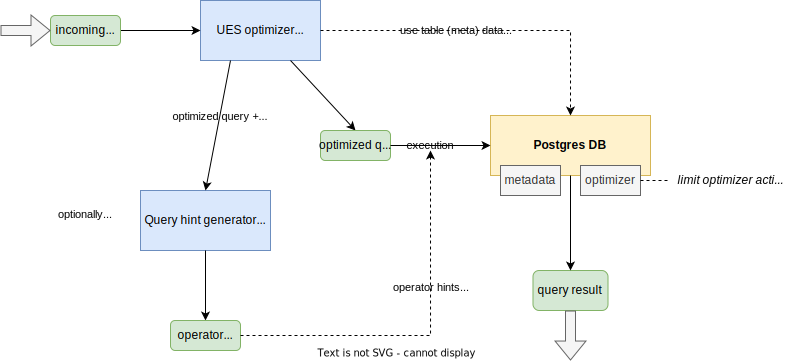

# Simplicity++

This repository modifies and extends the UES algorithm for upper bound-based join ordering of SQL queries, which was
originally proposed by Hertzschuch et al.[^0].

The implemented modifications have multiple goals:

1. support new query structures and workloads
2. enable modification of core components of the algorithm (base table cardinality estimation, join cardinality estimation, subquery generation)
3. generalize the original UES idea for calculating upper bounds of join cardinalities, thereby tightening the bounds

## Overview

The repository is structured as follows:

| Folder        | Description |
| ------------- | ----------- |
| `doc`         | Will contain documentation files + figures at some point, currently mostly unused. |
| `postgres`    | Contains utilities for setting up an entirely local Postgres instance (v14), as well as the required `pg_hint_plan` extension. |
| `ues`         | The main directory containing the UES implementation as well as most supplementary files (e.g. workload analysis). |
| `util`        | Contains some utilities for setting up database contents, cache management, workload generation, ... |
| `workloads`   | Contains query files for different workloads (currently Join Order Benchmark[^1] and Star Schema Benchmark[^2]). |

## Architecture

The following description focuses on tools located in the `ues` directory.
The main component of Simplicity++ is the customizable, UES-based query optimizer. It can be interfaced with directly
on the command line via the `ues-generator.py` utility. Alternatively, the optimizer can be called from a Python script
by including `transform/ues.py` and calling the `optimize_query` function. A more detailed description is provided in
an (work in progress) README in the `ues` directory. The UES component will determine an optimized join order for an
incoming SQL query, optionally along with the calculated upper bounds. This query can then either be executed directly
by Postgres, or improved physical join operators can be determined via a second component (accessible via the
`query-hinting.py` utility or again as part of a Python script by importing `postgres/hint.py`). These operators are
derived based on the upper bounds previously calculated.

When executing the query in Postgres, make sure to set the following parameters: `SET join_collapse_limit = 1;` (this
ensures that the join order calculated by UES is not modified by the Postgres optimizer). `SET enable_nestloop = 'off';`
(if no operator hints were generated this disables Nested Loop Joins, as documented in the UES paper[^0]). For
experiemnts we also use `set enable_memoize = 'off';` to disable Memoize operators, since they made experimental results
harder to reproduce.

Please note that query hints are currently under active development and may not proof beneficial, yet.

## Improved upper bounds

One of the main contributions of Simplicity++ is the tightening of upper bounds used by UES. This is achieved by
leveraging full Top-k lists for attributes (or Most Common Values lists), rather than only considering the highest
attribute frequency. This estimation enables a precise calculation of output cardinalities for certain attribute values
and improves the statistics for the fallback UES procedure.

For a more detailed explanation of this procedure, consult the (currently also work in progress) paper on Simplicity++.

## Literature

[^0]: Simplicity Done Right for Join Ordering - Hertzschuch et al., CIDR'21 ([paper](https://www.cidrdb.org/cidr2021/papers/cidr2021_paper01.pdf), [GitHub](https://github.com/axhertz/SimplicityDoneRight))
[^1]: Query Optimization Through the Looking Glass - Leis et al., VLDB 27 ([paper](https://db.in.tum.de/~leis/papers/lookingglass.pdf))
[^2]: Star Schema Benchmark - O'Neil et al. ([paper](https://www.cs.umb.edu/~poneil/StarSchemaB.PDF))
