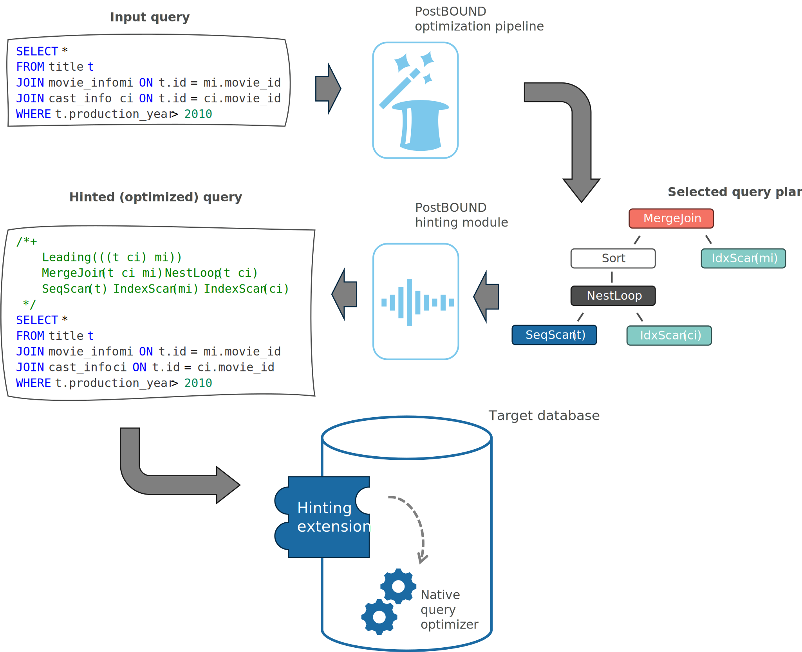

.. _hinting:

Hinting
=======

One of the core design goals of PostBOUND is to enable the execution of query plans on actual database systems rather than
using simulated environments or lab settings.
The reasoning behind this goal is that recent benchmarking studies have shown a large discrepancy between the improvement
of novel optimization techniques on their respective error metric (typically the q-error) and the actual impact on the
query plans [Han22]_, [Kim22]_. Likewise, in our SIMGOD 2025 study, we found that small scale changes in estimation
accurary can have a completely arbitrary impact on the actual query plans [Bergmann25]_.
Therefore, we treat the query execution time as the ultimate performance metric to judge the quality of a new optimization
technique.
At the same time, PostBOUND is implemented as a Python framework that needs to run on top of an actual database system.
This raises the question how we can ensure that the optimization decisions that are made within PostBOUND can be retained
when the native query optimizer of the database system is executed.
The answer is to use query hints which restrict the search space of the native optimizer in such a way that the query plan
selected by the native optimizer is the same as the one selected by PostBOUND.

General concept
---------------

Many database systems provide query hints to influence the query optimizer. However, support varies widely between the
systems. For example, `Oracle <https://docs.oracle.com/en/database/oracle/oracle-database/21/tgsql/influencing-the-optimizer.html#GUID-C558F7CF-446E-4078-B045-0B3BB026CB3C>`_
has pretty extensive support for hints, whereas `MySQL <https://dev.mysql.com/doc/refman/9.3/en/optimizer-hints.html>`_ 
has less hints and hints are sometimes not binding.
PostgreSQL does not support query hints out of the box, but relies on extensions such as `pg_hint_plan <https:://github.com/ossc-db/pg_hint_plan>`_
to implement the corresponding functionality.
Hints are typically intended to fix issues with the query plans generated by the native optimizer, such as disabling a
specific join algorithm for some join in the query. To specify hints, they are embedded in the SQL query using the block comment
syntax.

For example, the following hint tells the PostgreSQL optimizer to use a hash join to compute the query:

.. code-block:: sql

    /*+ HashJoin(t mi) */
    SELECT *
    FROM title t
    JOIN movie_info mi
    ON t.id = mi.movie_id
    WHERE t.production_year > 2000;

In PostBOUND, we use hints more broadly to ensure that all optimization decisions made within the framework are retained
when the query is executed on the database system.
The general hinting process can be outlined as follows:

   From SQL query to query plan to hinted query.

For a given input query, the :doc:`optimization pipeline <optimization>` first generates a query plan (or a subset of
optimization decisions). Depending on the target database, the hinting backend generates hints in the required
system-specific syntax to enforce these decisions. This results in a modified version of the original query that contains
the hints. This query is then shipped to the database system for execution. In the database system, the hinting module
influences the query optimizer to selected a query that matches the supplied hints.

Partial hints
-------------

One advantage of a hint-based approach is that hints do not necessarily have to cover the entire query plan.
Instead, they can be used to restrict the search space of the native optimizer to just a subset of all potential candidate
plans.

This enables PostBOUND to apply a "fill the gaps" principle: optimization pipelines can just concern themselves with
specific aspects of the query optimization process, such as cardinality estimation, and let the native optimizer use its
actual algorithms to figure out the rest of the query plan.
This is in contrast to other approaches such as `Substrait <https://substrait.io/>`_ that require an entire query plan.

For example, the following hint block would only enforce the join order and cardinality estimates for a query, but let the
native optimizer select the physical operators that seem most appropriate:

.. code-block:: sql

    /*+
        Leading(((u p) c))
        Rows(c #172156)
        Rows(p #11847)
        Rows(u #40325)
     */
    SELECT COUNT(*)
    FROM comments AS c, posts AS p, users AS u
    WHERE c.UserId = u.Id
    AND u.Id = p.OwnerUserId
    AND c.CreationDate >= CAST('2010-08-05 00:36:02' AS timestamp)
    AND c.CreationDate <= CAST('2014-09-08 16:50:49' AS timestamp)
    AND p.ViewCount >= 0
    AND p.ViewCount <= 2897
    AND p.CommentCount >= 0
    AND p.CommentCount <= 16
    AND p.FavoriteCount >= 0
    AND p.FavoriteCount <= 10;

This principle is extensively used in the :class:`~postbound.MultiStageOptimizationPipeline`, which is therefore the
preffered pipeline for optimization tasks that are not concerned with the entire query plan.

Hinting backends
----------------

The specific query hints that are generated by PostBOUND depend on the target database system and its hinting capabilities.
For example, when using the pg_hint_plan extension for PostgreSQL, PostBOUND does not emit hints that set the cardinality
estimates for base tables, because the extension does not support this. Since the hinting backend as precise knowledge
about the target database system, it can also use other mechanisms to influence the query optimizer. For example, the
SQLite query optimizer treats ``CROSS JOIN`` statements diffeerently than normal ``JOIN`` statements and we can use them
to `encode the join order <https://sqlite.org/optoverview.html#manual_control_of_query_plans_using_cross_join>`_.
It is up to the hinting backend of the current database system to decide what the approach to enforce the optimization
decisions is. Therefore, the final query, its hint block and other modifications should be treated as an implementation
detail of the hinting backend and not as a part of the PostBOUND API. 

.. tip::

    For more complete hinting support in PostgreSQL, take a look at the `pg_lab <https://github.com/rbergm/pg_lab>`_
    project. PostBOUND's tooling is designed to integrate nicely with pg_lab. The Postgres interface supports both
    the pg_hint_plan extension and pg_lab, so you can use either one depending on your needs.

.. [Bergmann25]
  Rico Bergmann, Claudio Hartmann, Dirk Habich, and Wolfgang Lehner:
  "*An Elephant Under the Microscope: Analyzing the Interaction of Optimizer Components in PostgreSQL.*"
  SIGMOD 2025 (DOI: https://doi.org/10.1145/3709659)

.. [Han22]
    Yuxing Han, Ziniu Wu, Peizhi Wu, Rong Zhu, Jingyi Yan2, Liang Wei Tan, Kai Zeng, Gao Cong, Yanzhao Qin, Andreas Pfadler, Zhengping Qian, Jingren Zhou, Jiangneng Li, Bin Cui:
    "*Cardinality Estimation in DBMS: A Comprehensive Benchmark Evaluation*"
    VLDB 2022 (DOI: https://doi.org/10.14778/3503585.3503586)

.. [Kim22]
    Kyoungmin Kim, Jisung Jung, In Seo, Wook-Shin Han, Kangwoo Choi, Jaehyok Chong:
    "*Learned Cardinality Estimation: An In-depth Study*"
    SIGMOD 2022 (DOI: https://doi.org/10.1145/3514221.3526154)