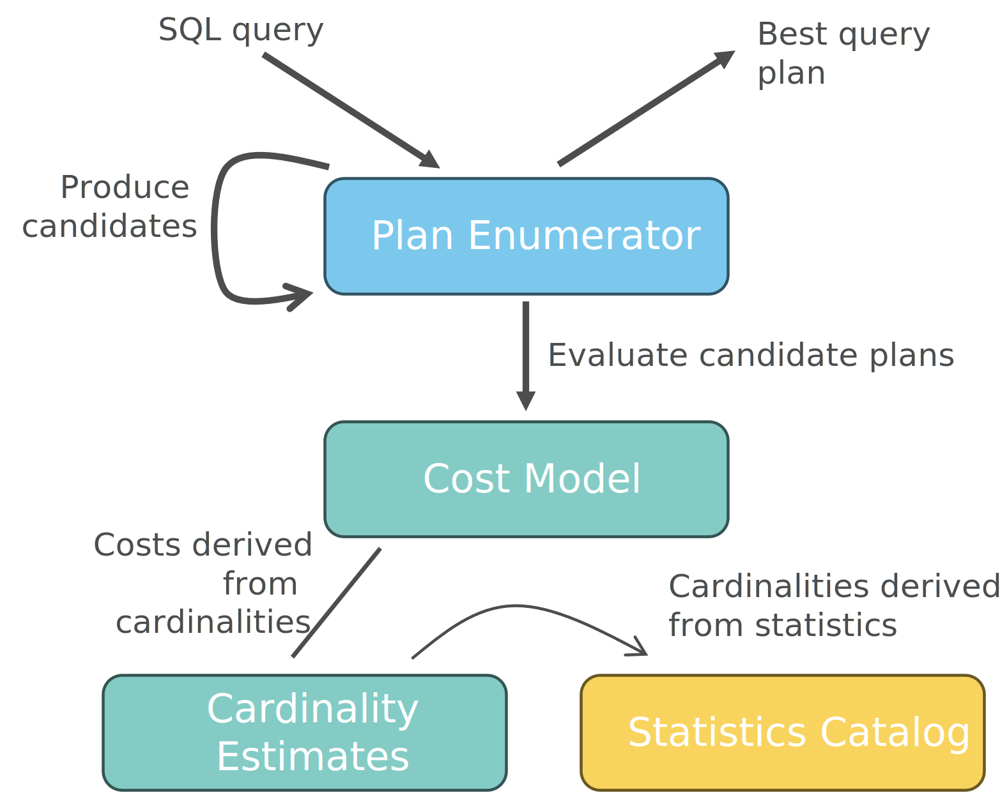

Optimizer Abstraction
=====================

To implement a new optimizer prototype in PostBOUND, you need to implement an appropriate
:class:`~postbound.OptimizationPipeline`. Pipelines are mental models for different optimizer architectures.
This section describes the most commonly used pipelines and how to use them. The final section contains a summary of the
core optimizer-related data structures.

.. _textbook-optimizer:

Textbook Optimizer Pipeline
---------------------------

The textbook optimizer pipeline models the traditional optimizer architecture consisting of plan enumerator, cost model,
and cardinality estimator.
The plan enumerator generates a set of candidate plans.
They are evaluated by the cost model and ultimately the plan with the lowest cost is selected.
The cost model uses cardinality estimates as its principal input to assess how much work each plan will require.
See the :class:`~postbound.TextBookOptimizationPipeline` for a full rundown of all available
methods.
Essentially, you can provide any combination of plan enumerator, cost model, and cardinality estimator.

   Architecture of a traditional textbook query optimizer.

- The :class:`~postbound.PlanEnumerator` is responsible for constructing and returning the final plan to
  be executed. It can use any algorithm it sees fit, such as traditional dynamic programming, greedy algorithms, or
  cascades-style enumeration. The enumerator also controls when to ask the cost model and cardinality estimator for their
  estimates. The main artifact of the enumerator is the plain :class:`~postbound.QueryPlan`.
- The :class:`~postbound.CostModel` estimates the cost of a plan. It receives the current plan along with the
  query as input and computes the execution cost of the plan. The plan must not compute the entire query, but can also be
  responsible for a smaller part of it. The cost model can query the cardinality estimator as it sees fit. By convention,
  if the cost model cannot estimate a plan or if a plan is otherwise invalid, *inf* costs should be returned. Currently,
  costs are expressed as plain Python floats.
- The :class:`~postbound.CardinalityEstimator` takes care of estimating the number of rows that an
  (intermediate) relation will contain. It receives the tables that form the intermediate along with the query as input.
  Similar to the cost model, the intermediate will typically be a subset of the entire query. The estimator can assume that
  all applicable filters and join conditions have already been applied to the intermediate. Cardinalities are modelled
  using the :class:`~postbound.Cardinality` class, which also allows to express unknown and infinite
  cardinalities.

.. _default-enumerator:

.. tip::

    If you do not implement your own plan enumerator, PostBOUND will select a dynamic programming-based algorithm (see
    :class:`~postbound.opt.dynprog.DynamicProgrammingEnumerator`) by
    default.
    If your target database happens to be a Postgres system, a DP algorithm specifically designed to mimic the Postgres
    algorithm will be used (see :class:`~postbound.opt.dynprog.PostgresDynProg`).

    In contrast to the :ref:`multi-stage pipeline <multistage-optimizer>`, we cannot simply let the target database system
    supply its own enumerator, because it is typically the enumerators job to request cost and cardinality estimates.
    This would mean that the target database system would need some way to call back into PostBOUND to obtain these
    estimates.
    While that is certainly an exciting possibility, we do currently not have the resources to investigate it further.

.. _multistage-optimizer:

Multi-stage Optimizer Pipeline
------------------------------

The multi-stage optimizer follows a sequential optimization approach.
The pipeline starts by computing a join order for the given query.
Based on this join order, the optimizer the computes the best physical operators for each join and scan operation.
Since both stages are optional, this pipeline is particularly well suited for scenarios where only a portion of the
optimization decisions should be overwritten and the native query optimizer should be used for the rest.
For example, you can use the multi-stage pipeline to only compute a join order.
In this case, the native optimizer has to select the best physical operators for each join and scan operation on its own.
To further support this use-case, you can also generate additional parameters in the pipeline.
These are used to restrict the native optimizer, e.g. by providing cardinality estimates for (some of the) relations.
These estimates would then overwrite the native cardinality estimator.

.. figure:: ../../figures/multistage-optimizer-architecture.svg
   :align: center
   :width: 35%

   Architecture of a multi-stage query optimizer.

See the :class:`~postbound.MultiStageOptimizationPipeline` for a full rundown of all
available methods.
Essentially, you can provide any combination of join ordering, operator selection and plan parameterization:

1. The :class:`~postbound.JoinOrderOptimization` is responsible for computing the
   :class:`~postbound.JoinTree` of the query. If this stage is skipped, the native optimizer has to
   perform its own join ordering.
2. The :class:`~postbound.PhysicalOperatorSelection` determines the scan and join operators for
   each intermediate of the query. Those are encoded in the
   :class:`~postbound.PhysicalOperatorAssignment`. If this stage is skipped, the
   native optimizer has to select its own physical operators. If the join order stage is skipped, the selected operators
   will only be used if their corresponding intermediates are actually calculated.
3. The :class:`~postbound.PlanParameterization` allows to generate metadata for the query plan.
   Currently, this includes cardinality estimates and parallel workers. How these parameters are used heavily depends on
   which other stages are used:

    - If a join ordering is performed, the cardinality estimates affect the operator selection (unless the operator
      selection is also used). Otherwise, cardinality estimates are used to determine the best join tree.
    - If an operator selection is performed, the cardinality estimates can be used to determine whether a parallel
      computation of the operator is beneficial (unless parallel workers are selected explicitly). Otherwise, the
      cardinality estimates directly influence the operator selection.
    - If neither join ordering nor operator selection is performed, the supplied cardinalities overwrite the native
      cardinality estimator.

.. tip::

    If your research area is cardinality estimation, both the textbook pipeline as well as the multi-stage pipeline can
    be used to implement prototypes. However, if you are not interested in plan enumeration or cost model, it might be
    a better idea to test your cardinality estimator using the
    :class:`~postbound.MultiStageOptimizationPipeline`.

    The reasoning behind this recommendation is that the textbook pipeline requires a plan enumerator which currently
    cannot be re-used from the target database system (because it is the enumerator's job to request cost and cardinality
    estimates, see :ref:`the textbook pipeline <default-enumerator>` for details).
    While the default enumerator can mimic the actual enumerator pretty well for PostgreSQL, it is still a simplification.

    On the other hand, the multi-stage pipeline just passes the cardinality estimates from the plan parameterization
    to the native optimizer. Therefore, the key idea is to use a multi-stage pipeline that does not perform any join
    ordering or operator selection. During the plan parameterization stage, estimates for all potential intermediates
    are generated.

    See the :ref:`Cookbook <cookbook-cardinality-estimation>` for a practical example. In short, by implementing your own
    cardinality estimator, you can use it both in a textbook pipeline as well as in a multi-stage pipeline.

Integrated optimization pipeline
--------------------------------

TODO

.. _optimizer-data-structures:

Fundamental data structures
---------------------------

.. _query-plan:

Query plans
^^^^^^^^^^^

The :class:`~postbound.QueryPlan` is the central artifact of the optimizer. It represents the physical execution
plan of a query (or a part of it). There are three main ways to obtain a query plan:

1. query plans can be created manually just like any other Python object
2. query plans are the main output of the optimization pipelines.
3. the :class:`~postbound.Database` provides an :class:`~postbound.db.OptimizerInterface`
   which in turn has a :meth:`~postbound.db.OptimizerInterface.query_plan` (and
   :meth:`~postbound.db.OptimizerInterface.analyze_plan`) method to the query plan that the database system
   would use to execute a specific query
4. query plans can be constructed from the optimizer artifacts (see below) using
   :func:`~postbound.opt.to_query_plan`

Use the normal :ref:`jsonize` tools to export query plans as JSON.
:func:`~postbound.opt.read_query_plan_json` can be used to load a plan back from its JSON
representation.

Optimizer artifacts
^^^^^^^^^^^^^^^^^^^

The :class:`~postbound.JoinTree` is used to represent the join order of a query. Nodes can be annotated
to keep track of additional information. Other than constructing a tree manually, trees can be extracted from query plans
via :func:`~postbound.jointree_from_plan`. Use the normal :ref:`jsonize` tools to export
join trees as JSON. :func:`~postbound.opt.read_jointree_json` can be used to load a tree back
from its JSON representation.

:class:`~postbound.PhysicalOperatorAssignment` and :class:`~postbound.PlanParameterization` can be used to reperesent
(partial) optimizer decisions.
Similar to join trees, these artifacts can be either constructed manually or extracted from query plans using
:func:`~postbound.operators_from_plan` or :func:`~postbound.parameters_from_plan`.
Use the normal :ref:`jsonize` tools to export them as JSON and :func:`~postbound.opt.read_operator_assignment_json` or
:func:`~postbound.opt.read_plan_params_json` to load them from their JSON representation.

.. tip::

    If you want to convert a query plan into all artifacts, you can use
    :func:`~postbound.opt.explode_query_plan` as a convenience function.

Join tree, operator assignment and plan parameterization can also be used to generate hinted queries. See the
:ref:`Cookbook <cookbook-partial-hinting>` for details.

.. _optimizer-utilities:

Optimizer utilities
-------------------

To aid the implementation of new optimizers, PostBOUND provides a number of commonly used data structures:

The :class:`~postbound.opt.JoinGraph` can be used to keep track of relations that have already been joined
or that can be integrated into a join tree.

Other utilities are implemented as pre-defined optimization stages, see :doc:`../advanced/existing-strategies` for
details.
