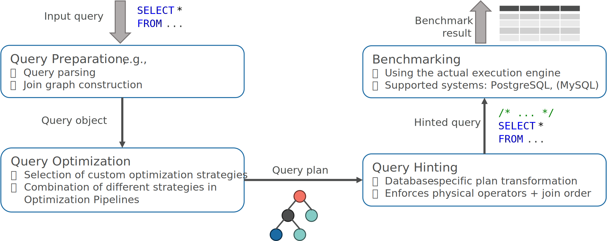

.. PostBOUND documentation master file, created by
   sphinx-quickstart on Thu Jul 20 11:40:53 2023.
   You can adapt this file completely to your liking, but it should at least
   contain the root `toctree` directive.

PostBOUND documentation
=======================

PostBOUND is a Python framework for research in query optimization.
It provides a high-level interface to implement novel optimization algorithms and to analyze their performance.

.. tip::
  New users should start by reading the :doc:`10minutes` tutorial and the
  :doc:`setup` guide.
  The remainder of the documentation describes the different parts of the framework in more detail.

In general, using the PostBOUND framework for optimizer research uses a workflow similar to the following:

   Typical workflow for using PostBOUND for optimizer research.

For an input query, PostBOUND provides a large set of infrastructure tools to prepare and analyze the query to limit the
boilerplate parts of the optimizer. This includes :doc:`query parsing <core/qal>`,
:ref:`join graph analysis <optimizer-utilities>`, and :ref:`others <database-infrastructure>`.
Rearchers specify their optimizer prototypes in terms of :doc:`optimization pipelines <core/optimization>`. Essentially,
these are mental models for different optimizer architectures that provide different interfaces to be implemented.
Since PostBOUND is implemented as a Python framework that runs on top of an actual database system, it needs to ensure that
the optimization decisions made within the framework are retained when the query is executed on the database system.
This is achieved by using :doc:`query hints <core/hinting>`, which restrict the search space of the native optimizer.
Hints are generated automatically depending on the target database system.
Finally, the :doc:`benchmarking tools <core/benchmarking>` allow to easily compare the performance of different
optimization strategies.

Contents
========

.. toctree::
  :maxdepth: 1

  10minutes
  setup
  core/index
  advanced/index
  cookbook
  API <generated/modules>

.. important ::

  This documentation is a work in progress and currently under construction.
  Currently, the best place to familiarize yourself with PostBOUND is to take a look at the
  `examples <https://github.com/rbergm/PostBOUND/tree/main/examples>`__.
  If you have any questions, please feel free to `open an issue on GitHub <https://github.com/rbergm/PostBOUND/issues>`__
  or `send us an email <mailto:rico.bergmann1@tu-dresden.de>`__.
  User experience is very important to us, and we are happy to help you get started.

Example
=======

The following example shows how PostBOUND can be used to implement a simple join order "optimization" algorithm.
The algorithm computes a random linear join order without considering any statistics or cost estimates.
The implementation is compared to the native PostgreSQL optimizer on the Stats benchmark.

.. code-block:: python
  :caption: End-to-end experiment with PostBOUND

  
  import random

  import postbound as pb

  class RandomJoinOrder(pb.JoinOrderOptimization):
      def optimize_join_order(self, query: pb.SqlQuery) -> pb.LogicalJoinTree:
          join_graph = pb.opt.JoinGraph(query)
          join_tree = pb.LogicalJoinTree()

          while join_graph.contains_free_tables():
              candidate_tables = [
                  join.target_table for join in join_graph.available_join_paths()
              ]
              next_table = random.choice(candidate_tables)

              join_tree = join_tree.join_with(next_table)
              join_graph.mark_joined(next_table)

          return join_tree

      def describe(self) -> pb.util.jsondict:
          return {"name": "random-join-order"}

  pg_instance = pb.postgres.connect(config_file=".psycopg_connection")
  stats = pb.workloads.stats()

  pipeline = (
      pb.MultiStageOptimizationPipeline(pg_instance)
      .setup_join_order_optimization(RandomJoinOrder())
      .build()
  )

  query_prep = pb.executor.QueryPreparationService(analyze=True, prewarm=True)
  native_results = pb.execute_workload(
      stats, pg_instance, workload_repetitions=3, query_preparation=query_prep
  )
  optimized_results = pb.optimize_and_execute_workload(
      stats, pipeline, workload_repetitions=3, query_preparation=query_prep
  )

  pb.executor.prepare_export(native_results).to_csv("results-native.csv")
  pb.executor.prepare_export(optimized_results).to_csv("results-optimized.csv")

Need more? There are a lot of `basic examples <https://github.com/rbergm/PostBOUND/tree/main/examples>`_ in the PostBOUND
repository!

History
=======

.. note::

  If you are looking for new features or bug fixes, please check out the
  `Changelog <https://github.com/rbergm/PostBOUND/blob/main/CHANGELOG.md>`_.

PostBOUND was initially created as framework to study pessimistic (or *upper bound-driven*) query optimization techniques
in PostgreSQL (hence the name).
An early version of the framework was presented at the BTW 2023 conference [Bergmann23]_.
Community feedback has been positive, but the focus on pessimistic query optimization was called into question.
Especially the idea of offering a general infrastructure to quickly test new ideas in query optimization was well received.
As a result, we decided to extend PostBOUND beyond the original scope and to provide truly general-purpose framework for
research in query optimization.
This revamped version of PostBOUND was presented as part of a SIGMOD 2025 research paper [Bergmann25]_.

Citation
========

If you found PostBOUND to be useful in your research, please cite the following paper.
Thank you!

.. code-block:: bibtex

   @article{DBLP:journals/pacmmod/BergmannHHL25,
      author       = {Rico Bergmann and
                      Claudio Hartmann and
                      Dirk Habich and
                      Wolfgang Lehner},
      title        = {An Elephant Under the Microscope: Analyzing the Interaction of Optimizer
                      Components in PostgreSQL},
      journal      = {Proc. {ACM} Manag. Data},
      volume       = {3},
      number       = {1},
      pages        = {9:1--9:28},
      year         = {2025},
      url          = {https://doi.org/10.1145/3709659},
      doi          = {10.1145/3709659},
      timestamp    = {Tue, 01 Apr 2025 19:03:19 +0200}
    }

Indices and tables
==================

* :ref:`genindex`
* :ref:`modindex`
* :ref:`search`

References
==========

.. [Bergmann23]
  Rico Bergmann, Axel Hertzschuch, Claudio Hartmann, Dirk Habich, and Wolfgang Lehner:
  "*PostBOUND: PostgreSQL with Upper Bound SPJ Query Optimization.*"
  BTW 2023 (DOI: https://doi.org/10.18420/BTW2023-14)

.. [Bergmann25]
  Rico Bergmann, Claudio Hartmann, Dirk Habich, and Wolfgang Lehner:
  "*An Elephant Under the Microscope: Analyzing the Interaction of Optimizer Components in PostgreSQL.*"
  SIGMOD 2025 (DOI: https://doi.org/10.1145/3709659)