.. PostBOUND documentation master file, created by
   sphinx-quickstart on Thu Jul 20 11:40:53 2023.
   You can adapt this file completely to your liking, but it should at least
   contain the root `toctree` directive.

Welcome to PostBOUND's documentation!
=====================================

**PostBOUND** is a Python framework that tries to make research in query optimization for relational database systems easier.
At its core it provides *optimization pipelines* that can be customized to implement and analyze different optimization
algorithms. These pipelines operate on abstract interfaces that describe how different optimization steps look like.
In addition to optimization pipelines, a large of collection of general code is also provided. This infrastructure code takes
care of many of the tedious work that needs to be done before an actual optimization algorithm can be implemented. For example,
a *query abstraction layer* models SQL queries and provides means to parse and transform them. Furthermore, the *database*
package enables easy access to the statistics and matadata catalogs of actual database systems and contains functionality to
generate system-specific database hints that enforce the decisions made during query optimization. For example, such decisions
can concern the join order or the selection of physical operators.

All of these components are described in more detail in this user documentation, as well as in the documentation of the source
code itself. The entire framework is open source and you are very much welcome to take a look at the actual implementation.
After all, the source code is the single point of truth. If you want to investigate the source code, start with the
``__init__`` file in the main PostBOUND module.

The query optimization process of PostBOUND is summarized in the following figure:

    Query optimization process in PostBOUND.

The query optimization itself is executed in the optimization pipeline. The target database ensures that the optimized query
plan is actually used when the query is executed on the database. Typically, this is achieved by generating a set of
system-specific query hints.

Example
-------

To get an idea of what is possible with PostBOUND, here is an example that combines different optimization strategies to
optimize queries. It uses the UES approach for join order optimization in combination with the TONIC algorithm for selecting
physical join operators. This optimization pipeline is applied to the Join Order Benchmark and executed on a Postgres database
instance.

.. code-block:: python

    import postbound as pb                  # most parts of PostBOUND are directly accessible from the main module
    from postbound.optimizer import presets # this provides utilities to easily load pre-defined optimization strategies
    from postbound.optimizer.strategies import tonic

    postgres_db = pb.db.postgres.connect()  # for details see the section on database interaction
    job = pb.workloads.job()                # load the benchmark

    presets.apply_standard_system_options()  # this handles some common configuration options
    ues_settings = presets.fetch("ues")      # load the optimization strategies
    tonic_operators = tonic.TonicOperatorSelection.load_model("tonic_model.json")

    optimization_pipeline = pb.TwoStageOptimizationPipeline(target_db=postgres_db)  # constructs our pipeline for Postgres
    optimization_pipeline.load_settings(ues_settings)                               # apply our optimization strategies
    optimization_pipeline.setup_physical_operator_selection(tonic_operators)        # use TONIC for physical operators
    optimization_pipeline.build()                                                   # get ready to optimize

    for label, query in job.entries():
        print("Now optimizing query", label)
        optimized_query = optimization_pipeline.optimize_query(query)

        print("Optimized query plan:")
        query_plan = postgres_db.optimizer().query_plan(optimized_query)
        print(query_plan.inspect())

        print("Now executing query", label)
        postgres_db.execute_query(optimized_query)

This example can be executed almost as-is. It lacks just a single piece of setup, namely a way to obtain a connection to the
Postgres database. By default, this is done using a hidden configuration file that provides the connect string for the
database. This file is called *.psycopg_connection*  and has to be located in the same directory from which the example is
run. More details on this topic can be found under :doc:`databases`.

What PostBOUND is *not*
-----------------------

Before you start diving into the documentation, let's quickly address some common misconceptions about what PostBOUND *is* and
what it *is not* about.

- PostBOUND is *not* an optimization algorithm. Rather, PostBOUND is a framework that tries to make the implementation of
  prototypes of optimization algorithms as easy as possible. For demonstration purposes and as a baseline for comparisons it
  also provides implementations of different optimization approaches.
- PostBOUND is *not* specific to one particular database system or benchmark. While both of these aspects are very important
  for a lot of research in query optimization, PostBOUND talks to abstract interfaces of databases and workloads to be as
  independent as possible. This enables studies about how well optimization algorithms generalize beyound the specific
  properties of one database system or workload.
- PostBOUND is *not* a database system, nor does it replace the optimizer of database systems. Instead, it acts as a wrapper
  around database systems and encodes optimization decisions in query hints. These hints in turn influence the actual optimizer
  of the database system. Nevertheless, hints can be used to specify entire physical query plans consisting of join orders as
  well as the physical operators. This also implies that PostBOUND does not execute queries itself. There is no execution
  engine in PostBOUND. Query execution happens entirely within the target database.

Documentation overview
======================

.. toctree::
   :maxdepth: 1

   setup
   optimization_process
   qal
   databases
   infrastructure
   ceb
   examples
   API documentation <generated/modules>

Indices and tables
==================

* :ref:`genindex`
* :ref:`modindex`
* :ref:`search`
